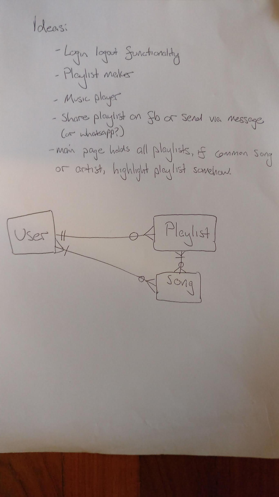
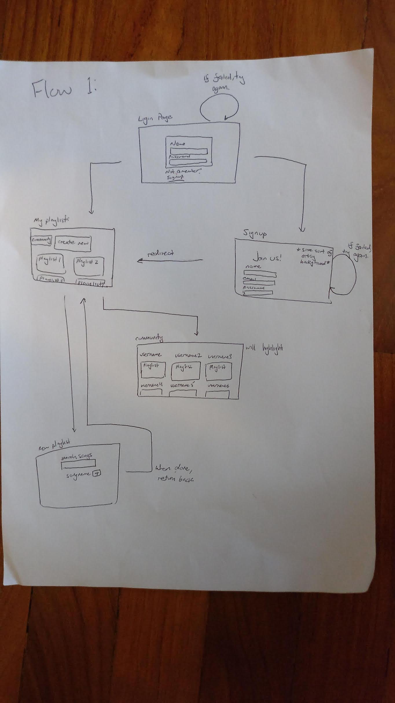

# GA Project 2: Muzik


## [Live demo here](https://muziknow.herokuapp.com/user)

## Introduction

Muzik is a website that will allow you to explore new music and make playlists to cater to any theme you might want.

--

## Overview

My project involved the usage of:
* The spotify API
* A 3 model design with users, music, and playlists

* The pure CSS framework

--

## Wireframes

Website design and flow


## Script - Notable things

### Authorization sucks

The spotify API depreciated its easy to use query system in favor of an oAuth 2.0 token model. This means that the code must first send a request to spotify for a token, and then upon receiving that token, then send another request back to spotify with the desired query and the authorized token.

On top of this, spotify only allowed me to send a request from the backend, which meant I had to figure out how to send an ajax request to spotify and then somehow send the resulting token to the front end.


### iframe
I used spotify's iframe embedded code to access the player.
```javascript
$('iframe').last().attr('src', `https://open.spotify.com/embed?uri=${song.uri}`)
```

### Mongoose population
It took me a while, but because I had a document referenced by a document which itself referenced a document, I needed to find a way to populate on multiple levels. In the end, this worked:
```javascript
User.findById(req.user.id)
.populate({
  path: 'playlists',
  model: 'Playlist',
  populate: {
    path: 'songs',
    model: 'Song'
  }
})
```
## Built With

* Mongodb
* mlab
* heroku
* Pure CSS framework
* node
* spotify API
* express
* mongoose
* jQuery

## Challenges and things to improve

### How to improve

#### The Website

(Note: Due to the setbacks caused by the spotify api, I never completed what I had in mind and had to scale back massively)
* Authentication when you sign in immediately (don't have to login)
* Full CRUD ability. Add ability to remove playlists and songs, as well as modify playlists.
* Ability to see the 'community', where all user playlists are listed
* Be able to see if other users have the same song as you do (A similar taste in music may mean you may like their music and will want to add it)
* recommendation software for music
* Include spotify authentication strategy since everything is pretty much spotify already

#### Myself

Better time management in the future – test out the waters to see if certain problems are solvable within the given time frame.

### Challenges

A big challenge for me was figuring out how to send information from the front end to the back end once I received my token.

The biggest challenge was the spotify api. It might be my lack of experience, (I'm pretty sure it's evil though) but the method to get a token was convoluted and unnecessary. (The fact that there many similar inquiries on how to get a token may also be in support of my opinion). Literally an entire * precious * day was spent just getting the API to work.

In hindsight, maybe I should have changed my API or attempted to access it earlier before selecting it. Because of this, I did not meet my soft launch deadlines or my general project deadlines.

## Acknowledgments

Thank you to Prima, Shimei, and WDI Classmates
